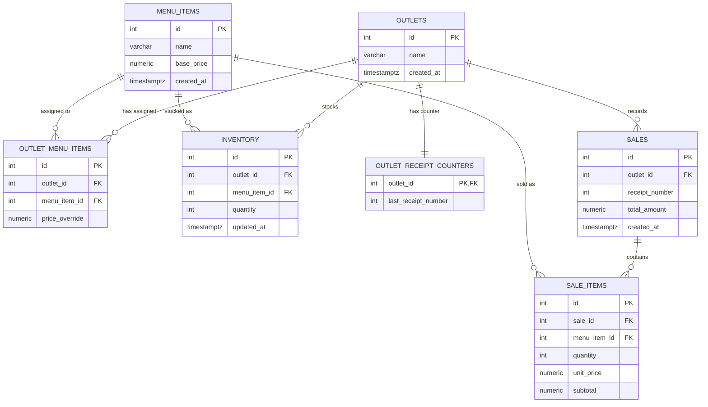

# Database ERD

## Notes on a few decisions

**`outlet_menu_items` is the assignment + price override table.** A menu item
only shows up for an outlet once a row exists here. `price_override` is
nullable — null means "use `menu_items.base_price`". This is resolved with a
`COALESCE` at query time rather than duplicating the price into every
outlet's row, so a HQ-wide base price change doesn't require touching every
outlet unless that outlet has explicitly overridden it.

**`inventory` is keyed on `(outlet_id, menu_item_id)`, unique.** Stock is
never shared across outlets — this was one of the explicit requirements. The
same menu item at two outlets is two separate rows with independent
quantities.

**`outlet_receipt_counters` is a separate table from `sales`,** one row per
outlet, holding only the last issued number. Receipt numbers are generated by
`UPDATE ... SET last_receipt_number = last_receipt_number + 1 RETURNING
last_receipt_number`, inside the same transaction as the sale insert. Postgres
takes a row lock on that `UPDATE`, so concurrent sales for the same outlet
queue up on that one row instead of racing to compute the same "next" number.
A `sales.(outlet_id, receipt_number)` unique constraint backs this up in case
the counter and the sales table ever drift.

**`sale_items` keeps its own `unit_price` and `subtotal`,** copied at the
time of sale, rather than joining back to `menu_items`/`outlet_menu_items` for
price. Prices change over time (HQ can update `base_price`, an outlet's
override can change); a receipt has to reflect what was actually charged on
that day, not today's price.

## Indexes

- `outlet_menu_items(outlet_id)`, `outlet_menu_items(menu_item_id)` — outlet
  menu lookups and reverse lookups ("which outlets have this item") both
  happen often.
- `inventory(outlet_id)` — every stock check and stock listing filters by
  outlet.
- `sales(outlet_id, created_at)` — the revenue report groups by outlet and
  most later reporting will want date ranges.
- `sale_items(sale_id)` — fetching a receipt's line items.
- `sale_items(menu_item_id)` — the top-selling-items report joins through
  this.
